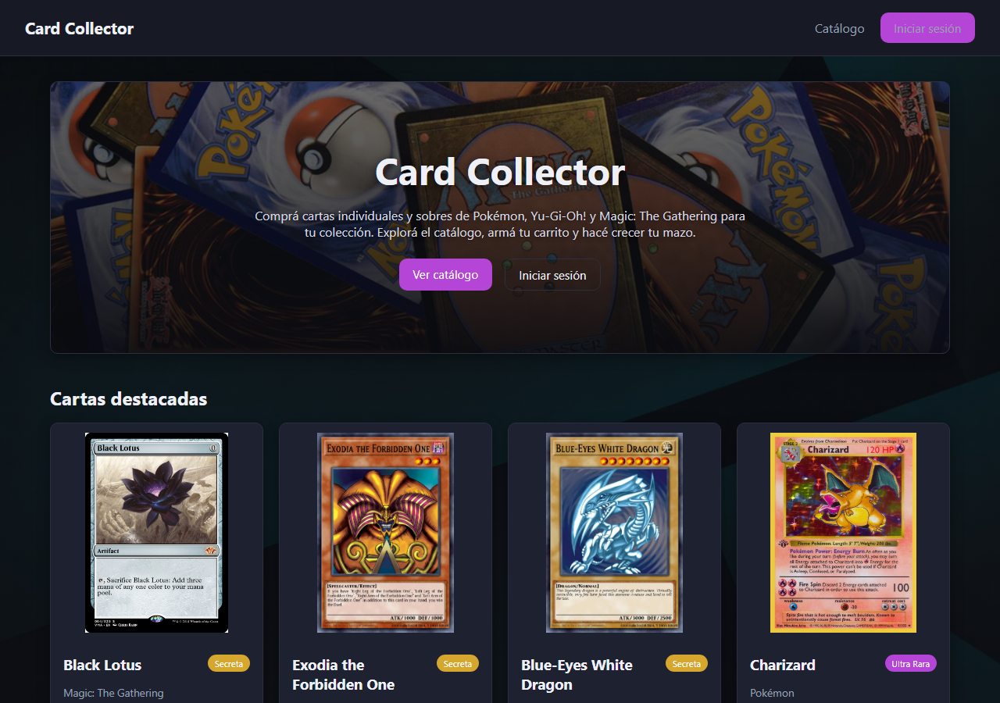

# Card Collector

Parcial 2 de Plataformas de Desarrollo.

## Integrantes

Federico Rousseau.

## Descripción

Card Collector es una tienda de cartas coleccionables de Pokémon, Yu-Gi-Oh! y Magic: The Gathering. Se puede ver el catálogo de cartas sueltas y sobres, agregarlos a un carrito y simular una compra. Los datos base están en archivos JSON y lo que se agrega, edita o elimina desde el panel de admin queda guardado en localStorage del navegador.

## Temática

Marketplace de cartas coleccionables (Por ahora, solo abarca Pokémon, Yu-Gi-Oh! y Magic).

## Usuarios y roles

- admin / admin123 → administrador
- cliente / cliente123 → cliente

El admin gestiona cartas y sobres (altas, bajas, ediciones) y puede ver todos los pedidos hechos. El cliente navega el catálogo, compra y ve su propio historial de pedidos.

## Entidades

Cartas y sobres (booster packs), más los pedidos que se generan cuando un cliente confirma una compra.

## Funcionalidades

- Login / logout con dos roles distintos
- Catálogo con filtro por franquicia y buscador
- Carrito y checkout simulado (descuenta stock y genera un pedido)
- Historial de pedidos por cliente
- Alta, edición, eliminación y listado de cartas y sobres desde el panel de admin, con validaciones en los formularios
- Rutas protegidas según el rol logueado

## Tecnologías

React, Vite, React Router, Context API, localStorage.

## Cómo correrlo

```bash
npm install
npm run dev
```

## Captura


